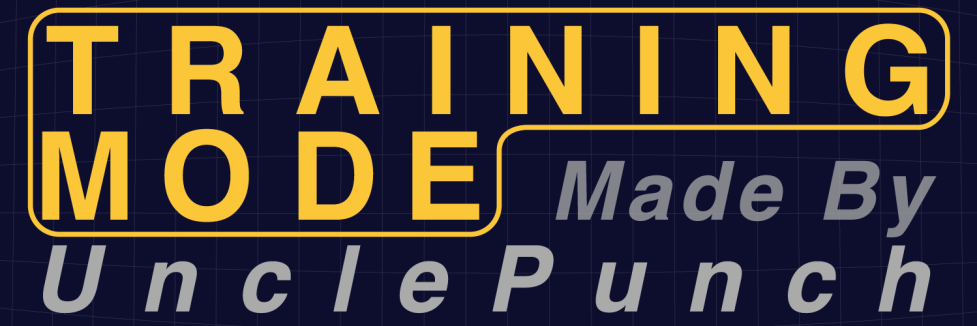



# Training Mode - A Melee Modpack for Practicing Tech

Training Mode is a modpack for Super Smash Bros. Melee that aims to streamline practice by providing pre-made individual training scenarios.
This mod utilizes the event mode present in Super Smash Bros. Melee and reworks them to focus around specific techniques,
complete with automatic savestate functionality to allow for rapid-fire practice. Some events have included video tutorials playable
in-game (ISO version only) to teach the player about the tech and how to perform it. In addition to these events,
Training Mode also includes onscreen text displays which provide you with information otherwise unavailable to you mid-game.

## How To Compile the ISO on Windows

1.) Fizzi36 wrote a program to mass assemble .asm files, it is included in the "Build TM Codeset" folder in this repository.
All you need to do is launch the "Build Training Mode Codeset.bat" file and the codes.gct file will be generated and placed in
the "Additional ISO Files" folder. This folder contains all the files you need to place into the ISO to run Training Mode minus
one file, the Start.dol.

2.) The Start.dol is the game's executable and contains copyrighted code, so for that reason I cannot distribute it.
However, if you manage to extract the Start.dol file out of your own ISO file you can patch the dol file to load
the codeset created prior. Look for the file named "Drag Melee v1.02 Start.dol Here.bat" located in the "Build TM Codeset" folder
and drag your extracted 1.02 NTSC Start.dol file onto the .bat file. The modified Start.dol will also
be place in the "Additional ISO Files" folder.

3.) You can now copy the contents of "Additional ISO Files" to an NTSC 1.02 Melee root folder and rebuild the ISO. I recommend using
GCR.

## How To Compile The ISO on MacOS

Note: I haven't tested this on Linux.

### Things you'll need

1.) Install [brew](https://brew.sh/)

2.) Run `brew install go wine xdelta`. This will install `wine` for running GCR, `go` for building our mass assembler, and `xdelta` for patching the .iso.

3.) Download a copy of [GCRebuilder](http://www.romhacking.net/utilities/619/)

4.) Clone or download the [JLaferri/gecko repo](https://github.com/JLaferri/gecko)

### Before your first build

Note: `$PROJECTROOT` prefers to the root of this project

1. `cd` into wherever you downloaded the JLaferri/gecko repo (e.x `~/Downloads/gecko`)
2. Run `go build`. This will generate a an executable called `gecko`. Place that executable in the `$PROJECTROOT/Build TM Codeset/mac` directory of this project
3. You'll need to extract the files from your Melee iso, this is where `wine` comes in handy.
    1. Before running wine, you will need to set up a fake drive to share files between wine<>mac. Navigate to `~/.wine/dosdevices` and create a symlink to a folder where you want to share files. e.g. `ln -s ~/winefiles w:`
    2. Move your melee .iso file to `~/winefiles` or whatever folder you created.
    3. Run `wine $PATH_TO_GCREBUILDER.exe` and GCRebuilder should open its own window.
    4. From there, Click Image -> Open and select your Melee iso. **Your Melee iso md5 hash should be equal to 0e63d4223b01d9aba596259dc155a174**.
    5. In the file explorer, right click "root" and select export. Choose a location to export the root folder to, likely the new `W:/` drive that you created earlier.

### Building

1. cd into `$PROJECTROOT/Build TM Codeset/mac`, and run `./gecko build` (you may need to run as sudo). This will mass assemble the `.asm` files in the `$PROJECTDIR/ASM` directory, you should end up with a `codes.gct` file in `$PROJECTDIR/Additional ISO files`.

Example output:

```none
Writing to ../../Additional ISO Files//codes.gct...
Successfuly wrote codes to ../../Additional ISO Files//codes.gct
Process time was 25.577666254s
```

2. Run `./modifyStartDol.sh $PATH_TO_YOUR_START.DOL`, where `$PATH_TO_YOUR_START.DOL` is at the `root/&&systemdata/Start.dol` in the location where you extracted the root folder before. This will generate a new `Start.dol` at `$PROJECTROOT/Additional ISO Files/Start.dol`

3. You can now copy the contents of `$PROJECTROOT/Additional ISO Files` to an NTSC 1.02 Melee root folder and rebuild the ISO, using GCRebuilder as we did in Step 3 in _Before your first build_.
    1. Manually copy `Start.dol` back into `root/&&systemdata`
    2. Manaully copy the contents of `audio` into `root/audio`, do not overwrite the whole folder as this will delete mandatory files
    3. Copy `codes.gct` and all the `.mth` files into `root/`
    4. Start up GCRebuilder again
    5. Before doing anything, click the options menu and select both options which should be `don't use game.toc` and `modify system files`
    6. Click 'root' -> 'open' and select the root folder you created before.
    7. Click 'root' -> 'save' and select a place to store a new `.iso` file
    8. Click rebuild!
        1. If you hit errors here about file size, close GCRebuilder, copy something like `MvMarth.mth` to overwrite `MvOMake15.mth` and/or `MvHowTo.mth` in the root folder, re-open GCRebuilder and try the steps again.

### Common Errors

1.) When running GCRebuilder with wine it crashes with **dyld: Symbol not found: _gliCreateContextWithShared**

A) [this](https://stackoverflow.com/questions/22732381/dyld-symbol-not-found-but-nm-reports-otherwise-os-x-update-issue) solves the issue.

2.) **xdelta3: target window checksum mismatch: XD3_INVALID_INPUT**

A) Your `Start.dol` you extracted from Melee isn't correct. Make sure your .iso has a md5 hash equal to `0e63d4223b01d9aba596259dc155a174`.
